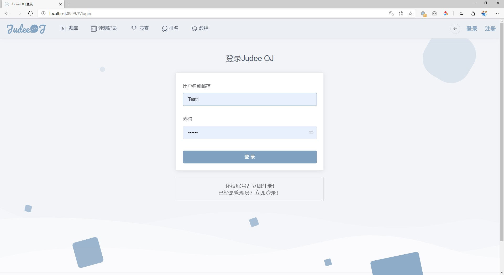
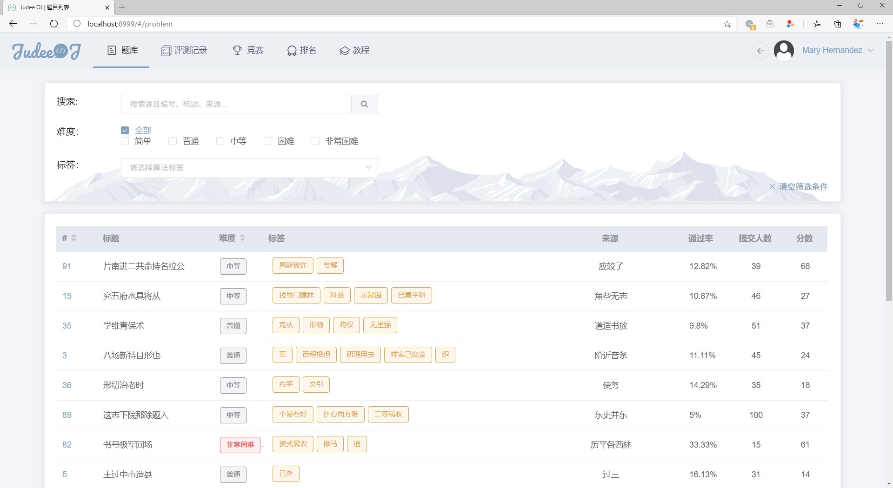
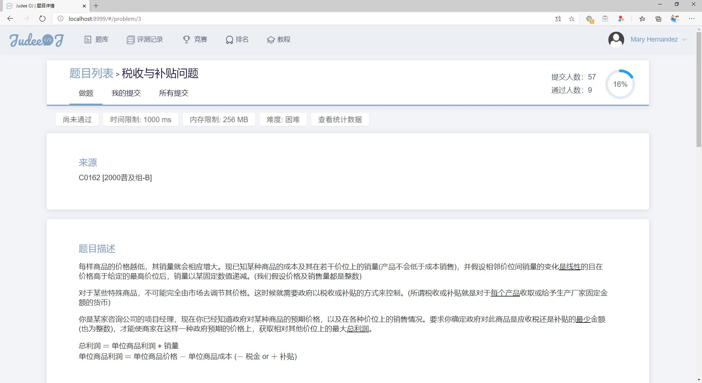
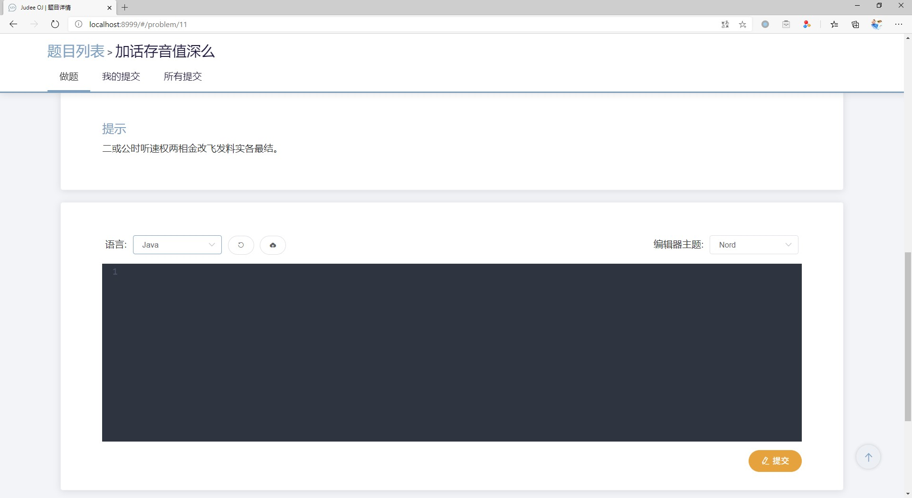
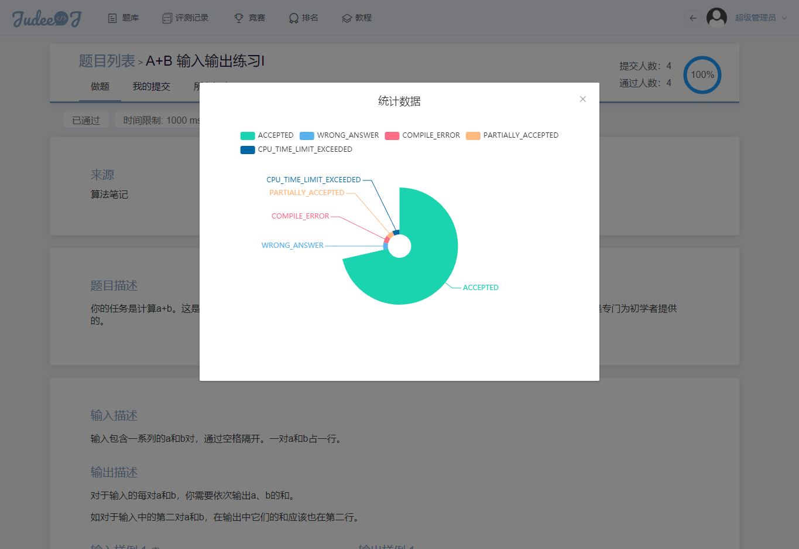
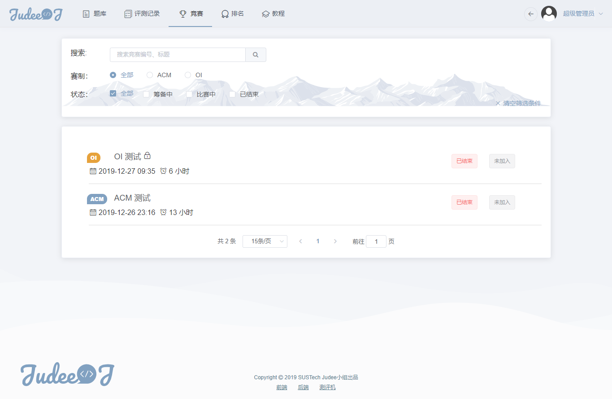
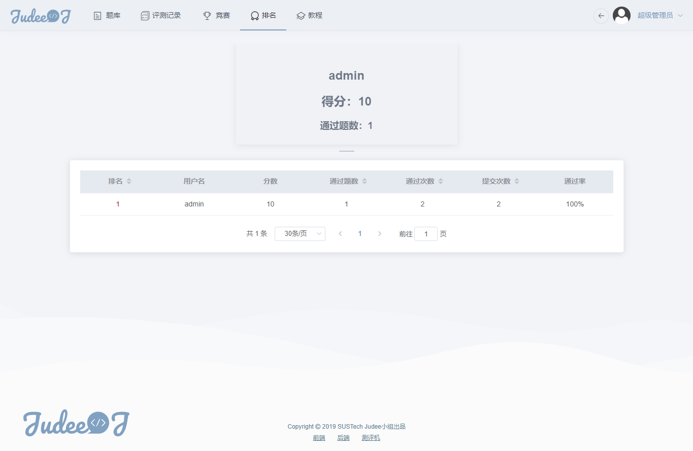
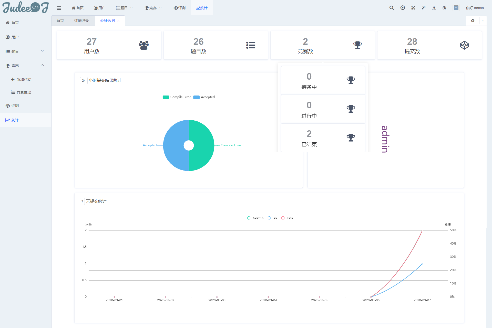
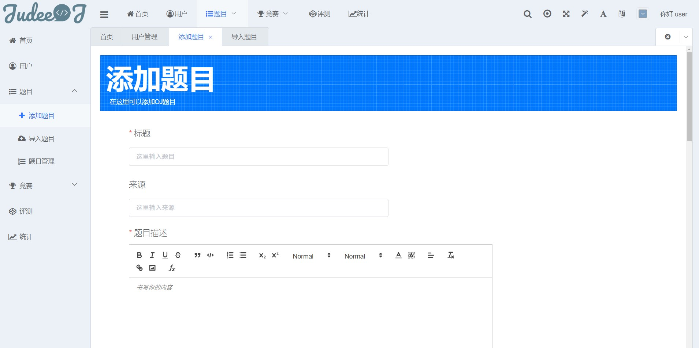
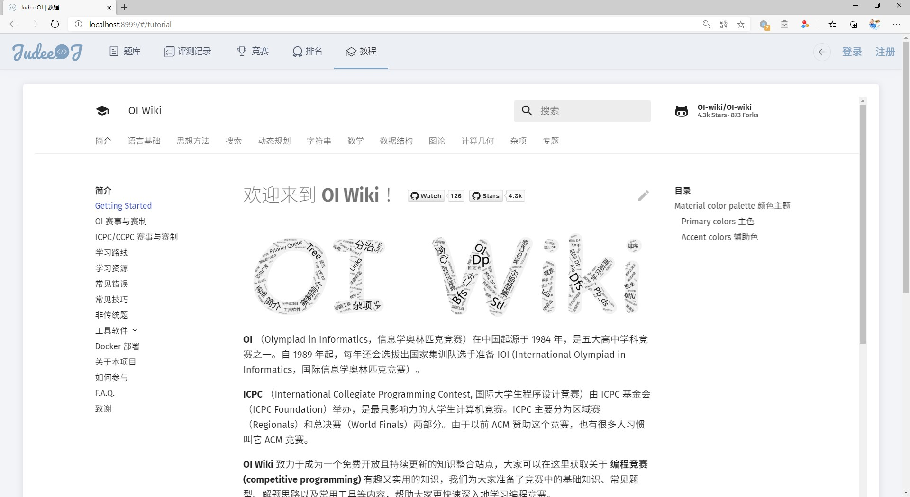

# Judee OJ前端项目 [](https://app.netlify.com/sites/judee/deploys)
> Vue CLI 3 多页应用项目, 网站配色为[Nord](https://www.nordtheme.com/)，ElementUI为UI组件库, D2Admin为后台管理模板

预览地址：[judee.netlify.app](https://judee.netlify.app)

## Judee项目特色
- 出色的网页设计
- 前后端分离开发
- 支持一键导入FPS题目
- 支持评测机docker镜像快速部署
- Redis缓存，多机器多进程判题

## 其他关联模块

- Judee后端(Django): https://github.com/darkliang/JudeeBE)
- Judee评测机: https://github.com/wht-github/JudeeJudger)

## 初始化

```bash
npm install
```

## 使用

* 开发：
  
    * 本地运行：`npm run serve`  
    * 修复代码格式错误：`npm run lint`
    * 开发API地址请修改`.env.development`的`VUE_APP_BASE_URL`和`vue.config.js`里的`target`
    
    ```js
       proxy: {
          '/api': {
            target: 'https://www.fastmock.site/mock/6c453883945216292945f471a2264433/judee',
            }
          }
        } // 配置开发环境 URL 便于本地开发调试
    ```
    
    
    
* 生产：
    * 编译: `vue-cli-service build`
    * 生产API地址请修改`.env.production`的`VUE_APP_BASE_URL`
    
## 目录结构说明

```
├─.browserslistrc 
├─.env 
├─.env.development 
├─.env.netlify 
├─.env.production 
├─.env.tests 
├─.env.travis 
├─.eslintignore 
├─.eslintrc.js 
├─.gitignore 
├─.idea 
├─.postcssrc.js 
├─babel.config.js 
├─jest.config.js 
├─jsconfig.json 
├─package-lock.json 
├─package.json 
├─public 
│ ├─favicon.ico 
│ ├─image ------------------------- // 静态图像
│ ├─index.html 
│ └─solid_favicon.ico 
├─README.md 
├─screenshots --------------------- // 截图
├─src 
│ ├─assets 
│ │ ├─style ----------------------- // 全局样式
│ │ └─svg-icons ------------------- // 矢量图标
│ ├─components -------------------- // d2Admin组件
│ │ ├─d2-container 
│ │ ├─d2-icon 
│ │ ├─d2-icon-svg 
│ │ ├─d2-module-index-banner 
│ │ ├─d2-quill 
│ │ ├─Highlight 
│ │ └─system.index.js 
│ ├─pages 
│ │ ├─admin ----------------------- // 管理后台
│ │ │ ├─api ----------------------- // 后台相关API
│ │ │ ├─App.vue 
│ │ │ ├─components 
│ │ │ ├─i18n.js 
│ │ │ ├─layout 
│ │ │ ├─libs 
│ │ │ ├─locales 
│ │ │ ├─main.js 
│ │ │ ├─menu 
│ │ │ ├─plugin 
│ │ │ ├─router 
│ │ │ ├─setting.js 
│ │ │ └─views 
│ │ │   ├─contest ----------------- // 竞赛相关页面
│ │ │   ├─problem ----------------- // 题目相关页面
│ │ │   ├─statistics -------------- // 统计数据相关页面
│ │ │   ├─submission -------------- // 提交相关页面
│ │ │   ├─system ------------------ // 功能性页面
│ │ │   └─user 
│ │ └─index ----------------------- // 前台页面
│ │   ├─api 
│ │   ├─App.vue 
│ │   ├─components ---------------- // 前台通用组件
│ │   │ ├─CodeMirror.vue 
│ │   │ ├─ColorPicker.vue 
│ │   │ ├─Introduction 
│ │   │ ├─MountainFooter.vue 
│ │   │ ├─NavBar.vue 
│ │   │ ├─SquareBackground.vue 
│ │   │ └─WaveFooter.vue 
│ │   ├─libs 
│ │   ├─main.js 
│ │   ├─router 
│ │   └─views --------------------- // 前台页面
│ │     ├─contest ----------------- // 竞赛
│ │     ├─Intro.vue 
│ │     ├─problem ----------------- // 题目
│ │     ├─rank -------------------- // 排名
│ │     ├─setting ----------------- // 设置
│ │     ├─submission -------------- // 提交
│ │     ├─tutorial 
│ │     └─user -------------------- // 个人信息
│ ├─plugin ------------------------ // Axios插件封装
│ │ ├─axiosAdmin 
│ │ ├─axiosOJ 
│ │ └─highlight.js 
│ ├─store ------------------------- // 状态管理
│ │ ├─system.index.js 
│ │ └─modules 
│ │   ├─d2admin 
│ │   └─oj 
│ ├─style 
│ └─utils ------------------------- // 全局工具类
│   ├─getBroswerInfo.js 
│   ├─util.const.js 
│   ├─util.cookies.js 
│   ├─util.db.js 
│   ├─util.formatter.js 
│   ├─util.js 
│   ├─util.log.js 
│   └─util.time.js 
├─title.js 
└─vue.config.js ------------------- // Vue配置
```

## 截图

#### 首页


#### 登录



#### 题目列表



#### 题目详情







#### 竞赛列表



#### 排名



#### 后台统计数据



#### 添加题目



#### 教程



## 参考资料

[Vue CLI 3 官方文档](https://cli.vuejs.org/zh/)

[Vuex 官方文档](https://vuex.vuejs.org/zh/)

[ElementUI 官方文档](https://element.eleme.cn/#/zh-CN/)

[Vue Router 官方文档](https://router.vuejs.org/zh/)

[D2 Admin 官方文档](https://fairyever.com/d2-admin/doc/zh/)
