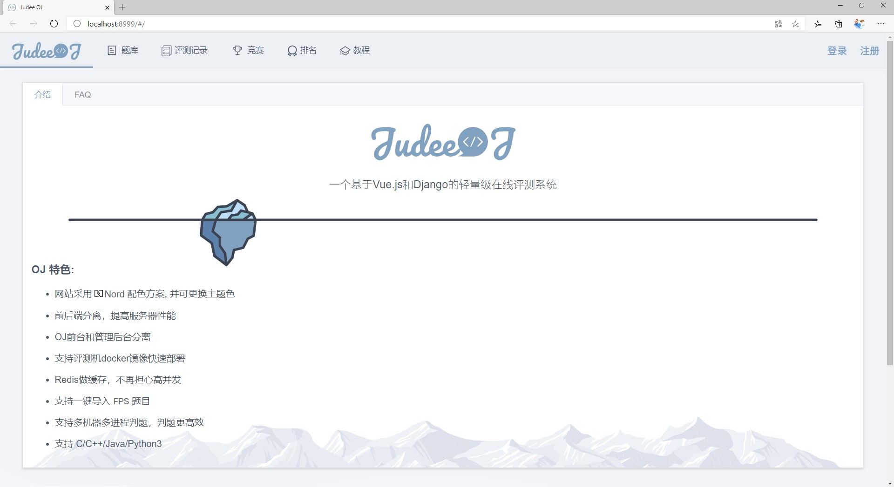
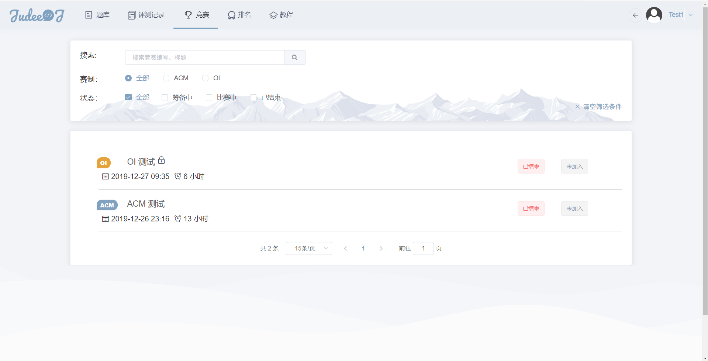

# Judee OJ前端项目
> Vue CLI 3 多页应用项目, 网站配色为[Nord](https://www.nordtheme.com/)，ElementUI为UI组件库, D2Admin为后台管理模板
[后端](https://github.com/darkliang/JudeeBE)
[评测机](https://github.com/wht-github/JudeeJudger)

## 初始化
```bash
npm install
```

## 使用
* 开发：
    * 本地运行：`npm run serve`  
    * 修复代码格式错误：`npm run lint`
* 打包：
    * 开发环境: `vue-cli-service build`
    
## 目录结构说明

鸽了🕊

## 截图

#### 首页



#### 登录


#### 题目列表


#### 题目详情


#### 竞赛列表



#### 排名


#### 后台统计数据


#### 添加题目


#### 教程


## 参考资料

[Vue CLI 3 官方文档](https://cli.vuejs.org/zh/)

[Vuex 官方文档](https://vuex.vuejs.org/zh/)

[ElementUI 官方文档](https://element.eleme.cn/#/zh-CN/)

[Vue Router 官方文档](https://router.vuejs.org/zh/)

[D2 Admin 官方文档](https://fairyever.com/d2-admin/doc/zh/)
